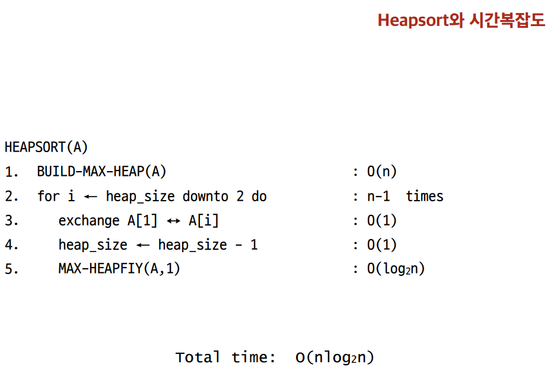

# heap sort

* 최악의 경우 시간복잡도 O\(nlog2n\)
* Sorts in place - 추가 배열 불필요
* 이진 힙\(binary heap\) 자료구조를 사용




### CODE

```java
public static void max_heapify(int a[], int i, int heapsize){
		if(i*2>heapsize)
			return;
		
		int k;
		if(i*2==heapsize)
			k = i*2;
		else {
			if(a[i*2] > a[i*2+1])
				k = i*2;
			else
				k = i*2+1;
		}
		
		if(a[i] >= a[k])
			return;
		
		int tmp = a[i];
		a[i] = a[k];
		a[k] = tmp;
		
		max_heapify(a, k, heapsize);
	}
	
	public static void build_max_heap(int a[]) {
		for(int i = (a.length-1)/2; i > 0; i--)
			max_heapify(a, i, a.length-1);
	}
	
	public static void heapsort(int a[]) {
		build_max_heap(a);
		int heap_size = a.length -1;
		for(int i = heap_size; i > 1; i--) {
			int tmp = a[1];
			a[1] = a[i];
			a[i] = tmp;
			
			heap_size--;
			max_heapify(a, 1, heap_size);
		}
	}
```

